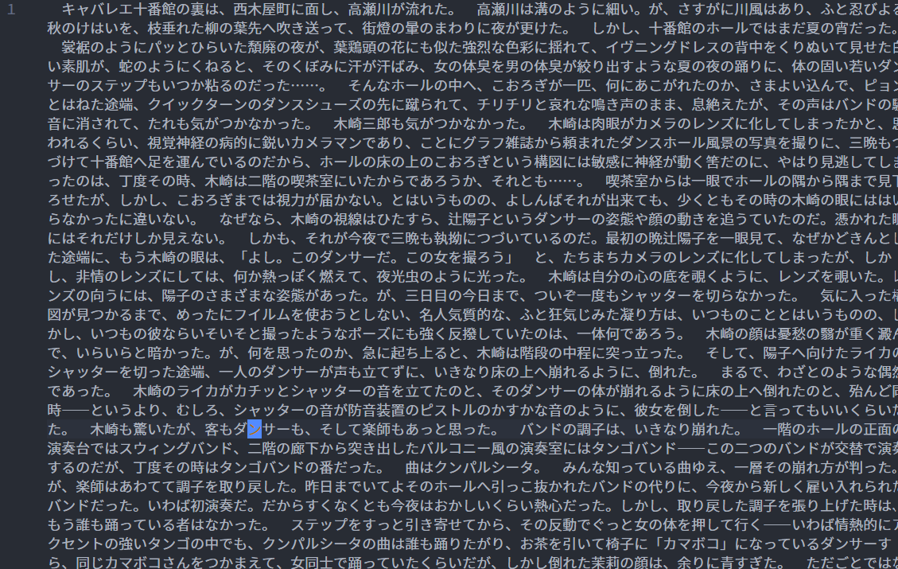
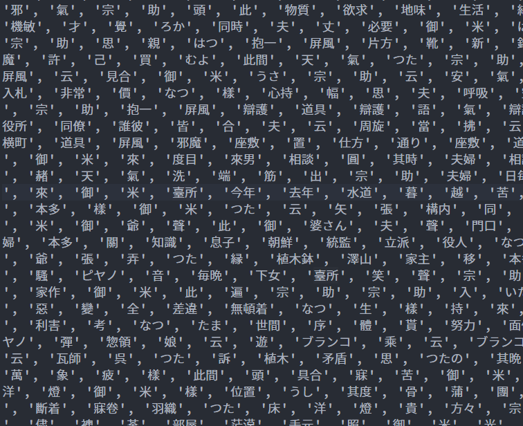
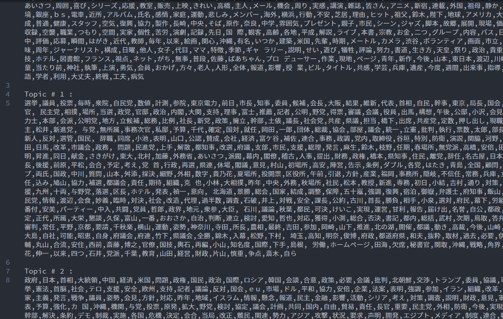
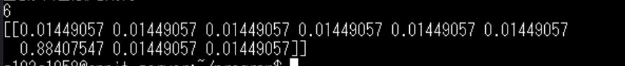

# Re:ゼロから始めるLDA・Twitter相性分析

このプログラムはLDA(Latent Dirichlet Allocation；潜在的ディレクリ配分法)を用いて、毎日新聞や読売新聞などのデータセットから大量の日本語記事の教師なし学習を行うことで各単語のトピックを分類し、さらにそれをTwitterのツイートに対して適用することで、Twitterアカウント同士の相性分析を行うことを試みたプロジェクトです。

# DEMO

1. 無駄な改行や情報の含んだ日本語の記事を正規表現などを用いて1行のプレーンテキストに整備する。



2. 形態素解析や正規化、ストップワードの除去といった前処理を丁寧に行い、できるだけ解析しやすい形に変換する。



3. LDAモデルを作成する



4. 作成したモデルを用いて任意の文書やテキストをトピック分類
（以下の画像は「東京・池袋で２０１９年４月、母子２人が死亡、９人が重軽傷を負った暴走事故で、 自動車運転死傷行...」というテキストに対してトピック数9でトピック分類した結果、トピック６に最も該当したという結果が得られた。）



5. このモデルをTwitterのツイート解析に利用して、その結果から相性分析を行う ← イマココ！

# Features

このプロジェクトは未完成です。随時更新を続けています。

# Requirement

このプログラムを作成するにあたって、以下のライブラリ及びデータセットを用いました。

-- Library --
* Python 3.8.10
* Gensim 4.1.2
* Scikit-learn 1.0.1
* Numpy 1.20.2
* Pandas 1.3.1
* Matplotlib 3.4.2
* MeCab 1.0.4
* Neologdn 0.5.1
* Tweepy 4.1.0
* Wikipedia 1.4.0 

-- データセット --
* 毎日新聞1995年・本社版（著作権の関係により非公開）
* 毎日新聞2011年、2015年、2016年、2019年本社版＋地方版（著作権の関係により非公開）
* 読売新聞2015年、2016年版（著作権の関係により非公開）
* 青空文庫全書籍データ（https://github.com/aozorahack/aozorabunko_text.git を利用させていただきました。ありがとうございます。)
* Wikipedia記事データ

# Installation

Requirementで示したライブラリを使用するにあたって、以下の手順によりインストールを行ってください。

```bash
pip install gensim
pip install sklearn
pip install numpy
pip install pandas
pip install matplotlib
pip install neologdn
pip install tweepy
pip install wikipedia
```

* MeCab
Python3以降は次のようにインストールしてください。
```bash
sudo apt install mecab
sudo apt install libmecab-dev
sudo apt install mecab-ipadec-utf8
pip install mecab-python3
```

なお、このプログラム中では度々新語辞書「NEologd」を用いています。NEologdのインストール方法は[こちら](https://analytics-note.xyz/mac/neologd-install/)を参照してください。


# Usage

まず、手元のワークツリーに以下のコマンドで複製してください。

```bash
git clone https://github.com/GinKuReNai/Twitter-Compatibility-Analysis-with-LDA.git
```

その後、1行で構成されたプレーンテキスト（デフォルトで使用できるプレーンテキストとして青空文庫のデータセットがあります。Gensim版LDAモデル(gensim_lda.py)は変更不要、Scikit-learn版LDAモデル（sklearn-lda.py）はコメントアウトされたパスに変更してください。)を入力としてLDAモデルを作成します。以下のコマンドを実行してください。

```bash
cd lda
python3 gensim_lda.py
python3 sklearn-lda.py
```

なお、1行で構成されたプレーンテキストであればどんなデータでも適切にLDAモデルが動作します。お好みで色々動かしてみてください。

最後まで演算が終了すると、LDAモデルが作成されています。（モデルの出力名と出力パスは適宜変更してください。）
最後に、そのモデルに対して任意のテキストをトピック分類し、最もらしいトピックを出力させます。（Twitter版はlda_twitter_output.py、Wikipedia版はlda_wikipedia_output.pyです。目的に応じて、lda_prototype_output.pyから派生させてください。）以下のコマンドを実行してください。

```bash
python3 lda_prototype_output.py
python3 lda_twitter_output.py
python3 lda_wikipedia_output.py
```

実行結果は DEMO に示した通りです。

# Note

このプログラムの実行にあたって、以下の注意があります。<br>
※1. 毎日新聞及び読売新聞のデータは非公開です。ご利用にあたっては、他のフリーのデータセットをご利用ください。<br>
※2. 著作権が失効していない書籍データも含まれています。詳しくは[「青空文庫収録ファイルの取り扱い規準」](https://www.aozora.gr.jp/guide/kijyunn.html)の元でご利用ください。<br>
※3. 環境によって正しく動作しないことが大いに考えられます。何か改善点やアイデアがございましたら大変恐縮ではございますが、何卒ご協力ください。

# Author

このGitHubアカウントの管理者：

* Akito Koga（古賀 秋音：こが あきと）
* Kyushu Institute of Technology（九州工業大学 情報工学部 知能情報工学科）
* akito121215@gmail.com

また、共同開発したメンバーをご紹介いたします。

* Yuki Yamada（山田 悠稀：やまだ ゆうき）
* Kyushu Institute of Technology（九州工業大学 情報工学部 知能情報工学科）
<br>
* Nobuaki Taniguchi（谷口 暢章：たにぐち のぶあき）
* Kyushu Institute of Technology（九州工業大学 情報工学部 知能情報工学科）
<br>
* Tadataka Mizo（溝 忠剛：みぞ ただたか）
* Kyushu Institute of Technology（九州工業大学 情報工学部 知能情報工学科）
<br>


最後まで見ていただきありがとうございました。